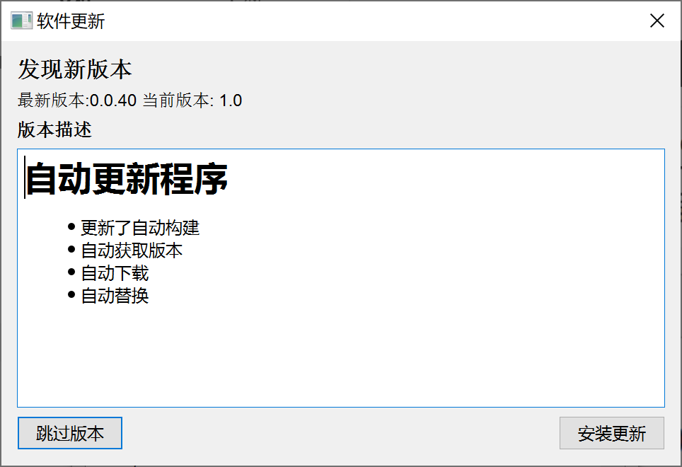
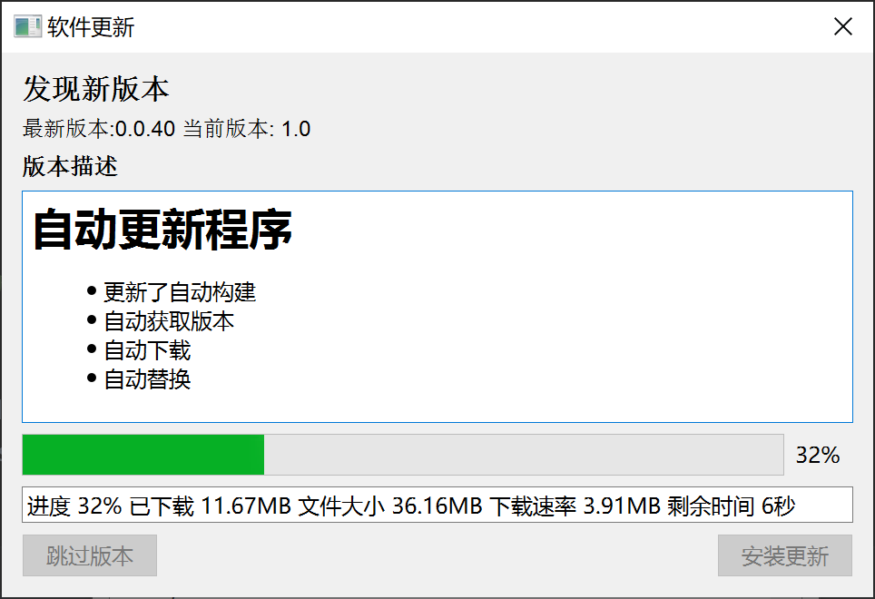

# pyqt 软件自动更新框架的程序演示


提供通用易于配置的 python 应用自动更新程序框架

适用于 pyinstaller 应用的自动更新 支持 pyqt 的应用 或者其他python应用使用

如果是 pyqt5 pyqt6 请自行修改 很简单 很容易

本演示程序由 Pyside6 构建

# 前言

由于搜遍了全网都没有找到一个能用的且方便的 python 软件自动更新的解决方案 

考虑到自动更新的框架原理并不复杂 所以自己动手造这个轮子吧~

以便以后开发的qt应用都能方便的进行软件迭代

这是一个全网唯一最易用的  python 应用 通用全自动更新框架 可跨平台使用


# 优点

* 支持 MacOS 系统应用更新

* 支持 Window 系统应用更新

* 无需服务器

* 使用 Github 自动构建软件和发布软件

* 客户端自动检查 Github 中发布的软件资源并自动更新

* 使用镜像对国内的网络进行优化 避免无法下载更新的情况







# 使用

## 文件结构

```
│  my_app.py
│  my_app_win.spec				window 构建软件配置
│  my_app_macos.spec			macos 构建软件配置
│  app.icns 					macos 应用图标
│  app.ico  					window 应用图标
│  requirements.txt
│  run_output_version.py		构建时写出的版本号文件的脚本
│  version.py					版本号文件 这个文件构建会被覆盖无需修改
│  版本描述.md					 发布应用的描述内容
├─.github
│  └─workflows
│          auto_tag.yml			自动构建tags版本号 
│          macos_x64.yml		自动构建macos应用
│          Windows_x64.yml		自动构建pc应用
└─自动更新模块
    │  ui_winUpdate.py			ui界面文件
    │  winUpdate.ui				qt designer 设计文件
    │  __init__.py
    │  压缩包文件处理.py
    │  文件下载模块.py
    │  窗口_更新软件.py			
    │  自动更新模块.py
    │  自动更新读取版本模块.py

```

## 主要复制

* 自动更新模块/
* .github/

* run_output_version.py
* version.py


# 注意

## 1 自动构建运行测试

用于检测程序是否成功构建 避免自动更新后软件无法打开 用户需要重新下载的情况


入口函数加入以下代码

```
if __name__ == '__main__':
    传入参数 = sys.argv
    if len(传入参数) == 2:
        参数1 = 传入参数[1]
        if 参数1 == "test":
            print("app run success")
            sys.exit(0)
```


## 2 弹出 软件更新 窗口


```
全局_项目名称 = "duolabmeng6/qtAutoUpdateApp"
全局_当前版本 = version.version

```


```
        self.winUpdate = 自动更新模块.窗口_更新软件(Github项目名称=全局_项目名称, 应用名称="my_app.app", 当前版本号=全局_当前版本)
        self.winUpdate.show()
```

## 3 软件中检测版本

```
        self.检查更新线程 = 自动更新模块.检查更新线程(全局_项目名称, self.检查更新回到回调函数)
        self.检查更新线程.start()

    def 检查更新回到回调函数(self, 数据):
        print("数据", 数据)
        最新版本 = 数据['版本号']
        self.label2.setText(f'最新版本:{最新版本}')
        self.textEdit.setText(json.dumps(数据, indent=4, ensure_ascii=False))
```

## 4 提交代码时自动构建版本号

如果你不想全自动构建 你可以自己触发工作流  下面的内容不用看了


```
.github/workflows/auto_tag.yml
```

注意

```
token: ${{ secrets.LONGLONG }} # 需要用自己的秘钥
```


在这里设置  https://github.com/settings/tokens

权限给 repo 和  project 就可以


得到秘钥以后在 `https://github.com/duolabmeng6/qtAutoUpdateApp/settings/secrets/actions`

配置秘钥环境变量 LONGLONG 填写为前面生成的 token 即可


## 5 自动构建软件脚本

```
.github\workflows\macos_x64.yml

.github\workflows\Windows_x64.yml
```


为了在 window 和 macos 中得到将最新版本写入

window写入版本号

```
    - name: Build
      run: |
        python run_output_version.py
        pyinstaller --noconfirm --onefile --windowed --icon "app.ico" "my_app.py"
```

由于 window的脚本我不会写 所以我用了python写入版本号

mac写入版本号

```
      - name: Build application
        run: |
          rm -rf build
          rm -rf dist
          # 获取当前的版本号
          version=$(git describe --tags --always)
          # 将版本号写入 version.py 文件
          echo "version = '$version'" > version.py
          pyinstaller my_app_macos.spec
```

由于mac的命令行简单些所以就用不着python 

以上操作均可使用 python run_output_version.py


# 同类项目

## Sparkle 

https://github.com/sparkle-project/Sparkle 

Sparkle 需要使用 xcode 进行版本管理 十分麻烦当然也可以使用 

思路

将 pyinstaller 构建好的应用内置在  xcode 代码中调用 就可以使用他进行更新

需要配置 秘钥 各种乱七八糟的事情..不利于自动化

我认为这种操作本末倒置..虽然他的更新机制很棒~但是使用极其麻烦且需要自行配置服务器


# 项目推荐

## Qt Esay Designer 由本人开发的开源 qt 界面设计器

https://github.com/duolabmeng6/QtEsayDesigner 

## pyefun python 中文功能函数库

https://github.com/duolabmeng6/pyefun

## qtefun python qt 中文组件函数库

https://github.com/duolabmeng6/qtefun