# pyqt 软件自动更新框架的程序演示

提供通用易于配置的 python 应用自动更新程序框架

适用于 pyinstaller 应用的自动更新 支持 pyqt 的应用 或者其他python应用使用

如果是 pyqt5 pyqt6 请自行修改 很简单 很容易

本演示程序由 Pyside6 构建

[查看自动更新的效果](https://user-images.githubusercontent.com/59047063/180640714-bc7fd160-3cb3-4b2a-af2c-8c73c7800740.mp4)

GithubActions 项目发布最佳实践 https://www.bilibili.com/video/BV1Ud4y1K7rv

# 前言

由于搜遍了全网都没有找到一个能用的且方便的 python 软件自动更新的解决方案 

考虑到自动更新的框架原理并不复杂 所以自己动手开始造轮子

以便后续开发的qt应用都能方便的更新迭代

这是一个全网唯一最易用的  python 应用通用全自动更新框架 无需自建服务器 可跨平台使用 


# 优点

* 支持 MacOS 系统应用更新

* 支持 Window 系统应用更新

* 无需服务器

* 使用 Github 自动构建软件和发布软件

* 客户端自动检查 Github 中发布的软件资源并自动更新

* 使用镜像对国内的网络进行优化 避免无法下载更新的情况


# 已在 Qt Easy Designer 中使用

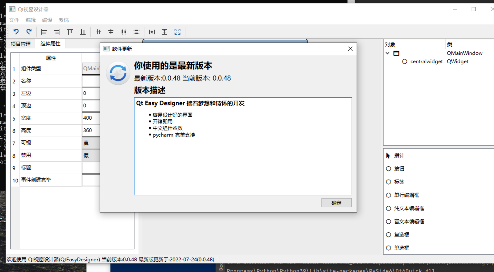

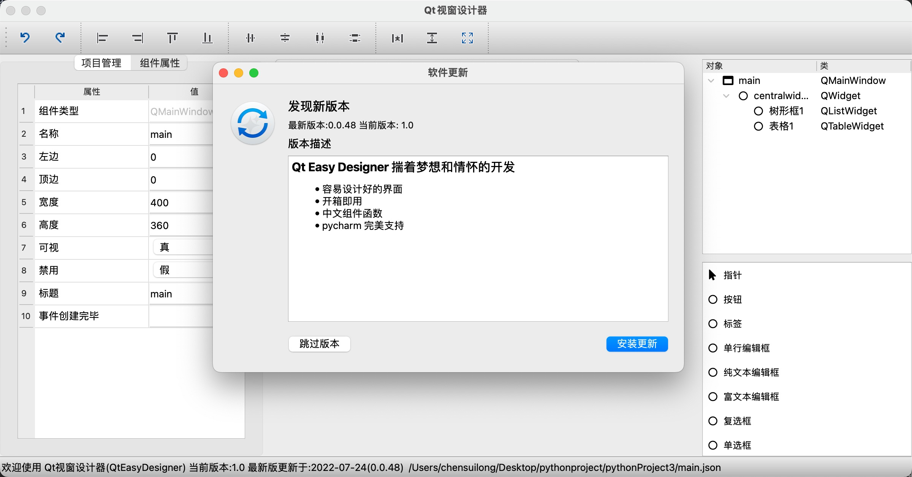

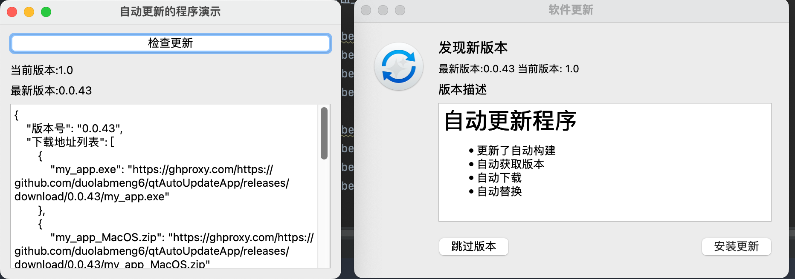

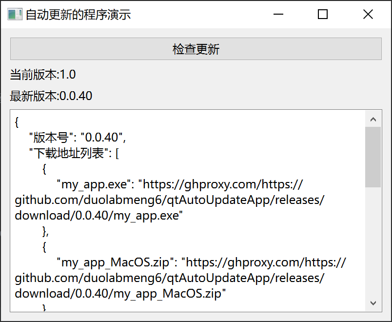


# 使用

## 文件结构

```
│  my_app.py
│  my_app_win.spec				window 构建软件配置
│  my_app_macos.spec			macos 构建软件配置
│  app.icns 					macos 应用图标
│  app.ico  					window 应用图标
│  requirements.txt
│  run_write_version.py		构建时写出的版本号文件的脚本
│  version.py					版本号文件 这个文件构建会被覆盖无需修改
│  版本描述.md					 发布应用的描述内容
├─.github
│  └─workflows
│          发布软件.yml			自动构建版本号 编译window软件和macos软件 自动发布 
└─自动更新模块
    │  ui_winUpdate.py			ui界面文件
    │  winUpdate.ui				qt designer 设计文件
    │  __init__.py
    │  压缩包文件处理.py
    │  文件下载模块.py
    │  窗口_更新软件.py			
    │  自动更新模块.py
    │  自动更新读取版本模块.py

```

## 主要复制

* 自动更新模块/
* .github/

* run_write_version
* version.py

# 使用

## 1 作为子模块使用

```shell
git submodule add https://github.com/duolabmeng6/qtAutoUpdateApp qtAutoUpdateApp
```

当然直接下载本项目也是可以的

```python
import qtAutoUpdateApp.自动更新模块 as 自动更新模块
import version
全局变量_版本号 = version.version
全局_项目名称 = "duolabmeng6/QtEasyDesigner"
全局_应用名称 = "QtEasyDesigner.app"
全局_当前版本 = version.version
全局_官方网址 = "https://github.com/duolabmeng6/QtEasyDesigner"
```

## 2 检查更新的回调

```python

    def 检查更新回到回调函数(self, 数据):
        # print("数据", 数据)
        最新版本号 = 数据['版本号']
        发布时间 = 数据['发布时间']
        发布时间 = 到时间(发布时间).取日期()
        try:
            最新版本 = f"最新版更新于:{发布时间}({最新版本号})"
        except:
            pass
            最新版本 = "查询失败"
        self.状态条标签.setText(f"欢迎使用 Qt视窗设计器(QtEasyDesigner) 当前版本:{全局变量_版本号} {最新版本}")

    def 更新版本号(self):
        self.检查更新线程 = 自动更新模块.检查更新线程(全局_项目名称, self.检查更新回到回调函数)
        self.检查更新线程.start()
```

## 3 弹出软件更新窗口


```shell
        if self.winUpdate is None:
            self.winUpdate = 自动更新模块.窗口_更新软件(Github项目名称=全局_项目名称,
                                            应用名称=全局_应用名称,
                                            当前版本号=全局_当前版本,
                                            官方网址=全局_官方网址)
        self.winUpdate.show()
```

## 4 程序入口加入代码

自动化检测是否能够运行和一些启动时的处理

```shell
if __name__ == '__main__':
    自动更新模块.初始化()

```

给自动化流程 测试软件是否能打开的


## 以上4个步骤就是在代码中的流程

还需要配置github自动构建的脚本请自行修改~

## 

# 配置仓库


## 配置文件 自动化编译脚本

文件位于 .github/workflows/发布软件.yml

### 1 构建版本号和变更信息

```yaml
  jobs_v:
    name: 构建版本号和变更信息
    runs-on: ubuntu-latest
    outputs:
      version: ${{ steps.create_version.outputs.tag_name }} # 版本号
      body: ${{ steps.create_version.outputs.body }} # 版本变更内容
    steps:
      - uses: release-drafter/release-drafter@v5
        id: create_version
        with:
          config-name: release-drafter.yml # 配置文件在 .github/release-drafter.yml
          disable-autolabeler: true # 禁止自动标签
        env:
          GITHUB_TOKEN: ${{ secrets.GITHUB_TOKEN }}
      - name: 查看变量
        run: |
          echo ${{ format('version={0}', steps.create_version.outputs.tag_name ) }} 

```

这里注意 输出的变量 version 和 body 是版本号和发布的内容

#### 发布的内容

文件位于 .github/release-drafter.yml

```
name-template: 'v$RESOLVED_VERSION'
tag-template: 'v$RESOLVED_VERSION'
categories:
  - title: '🚀 新功能'
    labels:
      - '新功能'
  - title: '🐛 Bug 修复'
    labels:
      - 'bug'
  - title: '🧰 日常维护'
    label: '日常维护'
change-template: '- $TITLE @$AUTHOR (#$NUMBER)'
change-title-escapes: '\<*_&'
version-resolver:
  major:
    labels:
      - 'major'
  minor:
    labels:
      - 'minor'
  patch:
    labels:
      - 'patch'
  default: patch
template: |
  # 自动更新程序
  * 更新了自动构建
  * 自动获取版本
  * 自动下载
  * 自动替换

  $CHANGES
no-changes-template: |
  快下载体验~

```

注意这里的 labels 是需要 pull 打标签才会生成的

template 为发布的内容 其中 `$CHANGES` 是版本之间的变更 也是通过 pull 才会显示的

##### pull 打标签

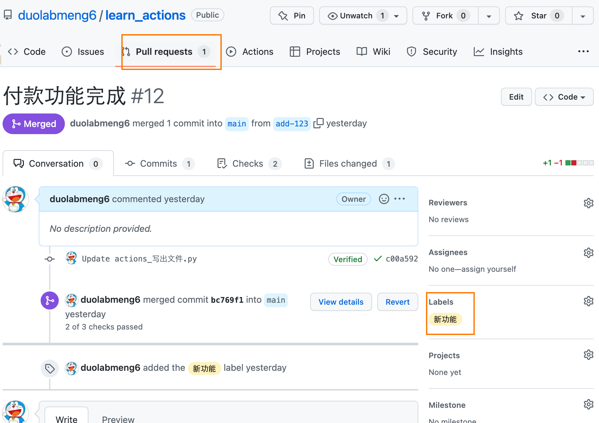

##### 发布版本时就会显示

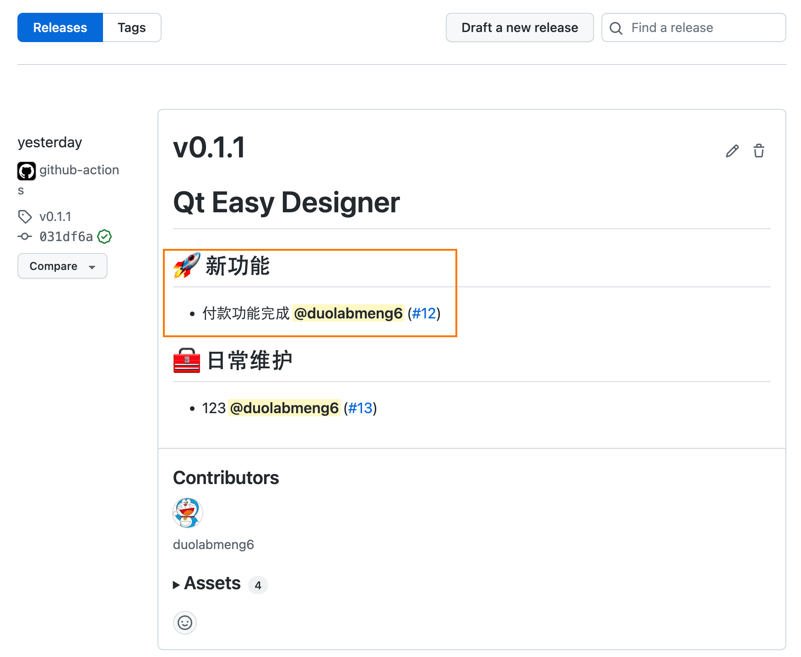

##### 标签的配置

https://github.com/duolabmeng6/learn_actions/issues/labels

注意一点 描述的内容必须删除 否则构建时会报错 版本变更将无法生产 删除即正常

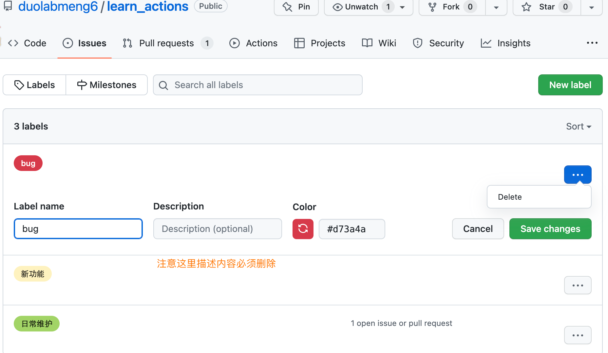

### 2 构建window软件

```yaml

  jobs_window:
    needs: jobs_v
    name: 构建window软件
    runs-on: windows-2022
    env:
      version: ${{ needs.jobs_v.outputs.version }}
      body: ${{ needs.jobs_v.outputs.body }}
    steps:
      - uses: actions/checkout@v3
        with:
          submodules: recursive
      - name: 读入环境信息
        run: |
          echo ${{ format('version {0}', env.version ) }} # 版本号
      - name: 编译环境设置 Python 3.9.13
        uses: actions/setup-python@v4
        with:
          python-version: "3.9.13"
          architecture: "x64"
          cache: 'pip'
      - name: 下载依赖文件
        run: pip install -r requirements.txt
      - name: 编译exe
        run: |
          python run_write_version.py
          pyinstaller --noconfirm --onefile --windowed --icon "app.ico" "my_app.py"
      - name: 测试运行情况
        uses: GuillaumeFalourd/assert-command-line-output@v2
        with:
          command_line: ./dist/my_app.exe test
          contains: app run success
          expected_result: PASSED
      - name: 上传产物
        uses: actions/upload-artifact@v3
        with:
          name: window
          path: ./dist/*.exe
```


### 3 构建macos软件


```yaml

  jobs_macos:
    needs: jobs_v
    name: 构建macos软件
    runs-on: macos-12
    env:
      version: ${{ needs.jobs_v.outputs.version }}
      body: ${{ needs.jobs_v.outputs.body }}
    steps:
      - uses: actions/checkout@v3
        with:
          submodules: recursive
      - name: 读入环境信息
        run: |
          echo ${{ format('version {0}', env.version ) }}
      - name: 编译环境设置 Python 3.9.13
        uses: actions/setup-python@v4
        with:
          python-version: "3.9.13"
          architecture: "x64"
          cache: 'pip'
      - name: 下载依赖文件
        run: pip install -r requirements.txt
      - name: 编译 MacOS.app
        run: |
          python run_write_version.py
          pyinstaller my_app_macos.spec
      - name: 测试运行情况
        uses: GuillaumeFalourd/assert-command-line-output@v2
        with:
          command_line: ./dist/my_app.app/Contents/MacOS/my_app test
          contains: app run success
          expected_result: PASSED
      - name: 创建压缩包
        run: |
          cd ./dist
          zip -r ./my_app_MacOS.zip ./my_app.app
      - name: 上传产物
        uses: actions/upload-artifact@v3
        with:
          name: macos
          path: ./dist/*.zip

```

### 4 发布版本

```yaml

  jobs4:
    needs: [ jobs_v,jobs_window,jobs_macos ]
    name: 发布版本
    runs-on: ubuntu-latest
    env:
      version: ${{ needs.jobs_v.outputs.version }}
      body: ${{ needs.jobs_v.outputs.body }}
    steps:
      - name: 下载产物
        id: download
        uses: actions/download-artifact@v3
        with:
          path: ./
      - name: 读入环境信息
        run: |
          echo ${{ format('version {0}', env.version ) }}
          echo ${{steps.download.outputs.download-path}}
          ls -R

      - name: 发布文件
        uses: ncipollo/release-action@v1
        with:
          token: ${{ secrets.GITHUB_TOKEN }}
          allowUpdates: true # 覆盖文件
          #draft: true # 草稿 自己可见 版本号会保持一样 默认是自动发布 latest
          #prerelease: true # 预发布 别人可以看到 版本号会继续加
          tag: ${{ env.version }} # 版本号 v0.1.0
          body: ${{ env.body }} # 输出的内容
          artifacts: "window/*.exe,macos/*.zip"
```


# 最后效果

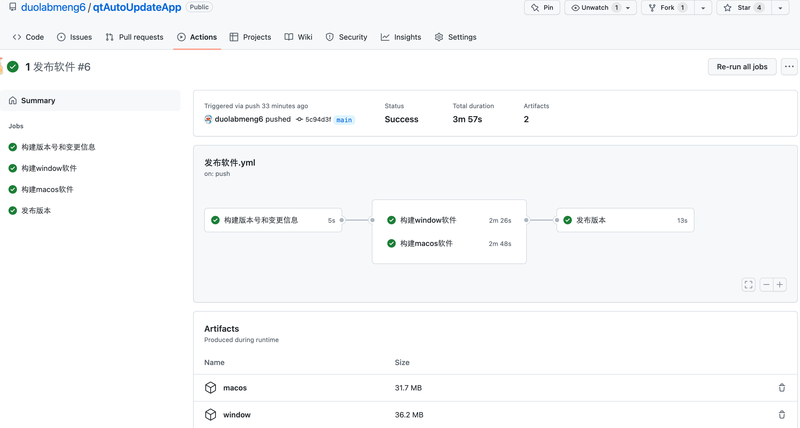


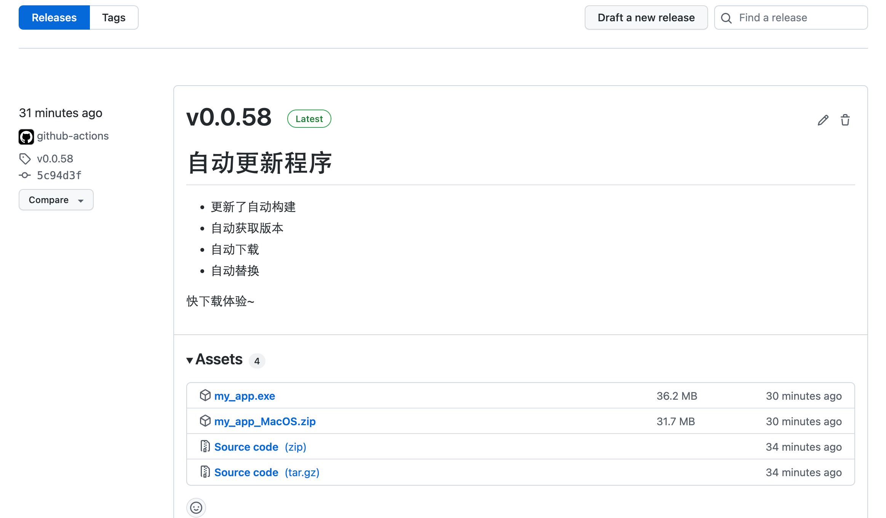


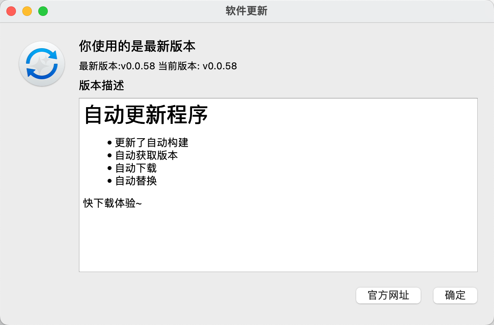


pull  打标签

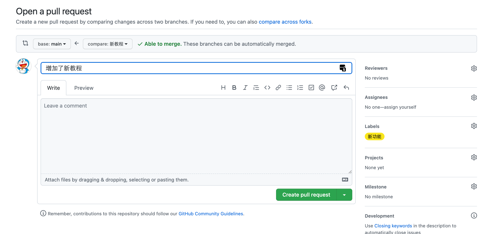


# 同类项目

## Sparkle 

https://github.com/sparkle-project/Sparkle 

Sparkle 需要使用 xcode 进行版本管理 十分麻烦当然也可以使用 

思路

将 pyinstaller 构建好的应用内置在  xcode 代码中调用 就可以使用他进行更新

需要配置 秘钥 各种乱七八糟的事情..不利于自动化

我认为这种操作本末倒置..虽然他的更新机制很棒~但是使用极其麻烦且需要自行配置服务器


# 项目推荐

## Qt Easy Designer 由本人开发的开源 qt 界面设计器

https://github.com/duolabmeng6/QtEsayDesigner

## pyefun python 中文功能函数库

https://github.com/duolabmeng6/pyefun

## qtefun python qt 中文组件函数库

https://github.com/duolabmeng6/qtefun
